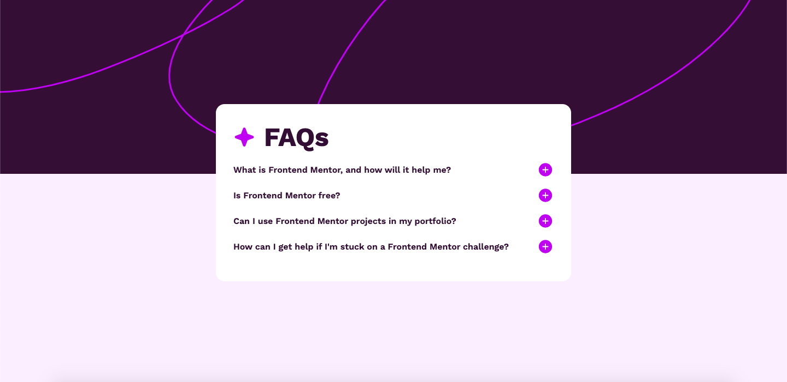

# Frontend Mentor - Social links profile solution

This is a solution to the [Social links profile challenge on Frontend Mentor](https://www.frontendmentor.io/challenges/social-links-profile-UG32l9m6dQ). Frontend Mentor challenges help you improve your coding skills by building realistic projects. 

## Table of contents

- [Overview](#overview)
  - [The challenge](#the-challenge)
  - [Screenshot](#screenshot)
  - [Links](#links)
- [My process](#my-process)
  - [Built with](#built-with)
  - [What I learned](#what-i-learned)
- [Author](#author)

**Note: Delete this note and update the table of contents based on what sections you keep.**

## Overview

### The challenge

Users should be able to:

- Hide/Show the answer to a question when the question is clicked
- Navigate the questions and hide/show answers using keyboard navigation alone
- View the optimal layout for the interface depending on their device's screen size
- See hover and focus states for all interactive elements on the page

### Screenshot



### Links

- Solution URL: [Add solution URL here](https://your-solution-url.com)
- Live Site URL: [Add live site URL here](https://your-live-site-url.com)

## My process

### Built with

- Semantic HTML5 markup
- CSS custom properties
- Mobile-first workflow
- Flexbox markup
- JavaScript markup

### What I learned

```html
<a href="#"><span>GitHub</span></a>
```
```css
.background-img {
    background-image: url('assets/images/background-pattern-desktop.svg');
    background-position: top;
    background-repeat: no-repeat;
    width: 100%;
    height: 100%;
    position: absolute;
    top: 0;
    left: 0;
    z-index: -1; 
}
```
```js
document.querySelectorAll('.faq-item').forEach(faqItem => {
    const button = faqItem.querySelector('.icon-button');
    const answer = faqItem.querySelector('.answer');
    const question = faqItem.querySelector('.question');
    const icon = button.querySelector('img');

    const showAnswer = () => {
        if (answer.style.display === 'none' || answer.style.display === ''){
            answer.style.display = 'block';
            icon.src = 'assets/images/icon-minus.svg';
        } else {
            answer.style.display = 'none';
            icon.src = 'assets/images/icon-plus.svg';
        }    
    };

    button.addEventListener('click', showAnswer);
    question.addEventListener('click', (e) => {
        if (e.target.tagName !== 'BUTTON' && e.target.tagName !== 'IMG'){
            showAnswer();
        }
    });
});

```

## Author

- Github - [Rakhat Zhumabek](https://github.com/R3iwan)
- Frontend Mentor - [@R3iwan](https://www.frontendmentor.io/profile/R3iwan)

